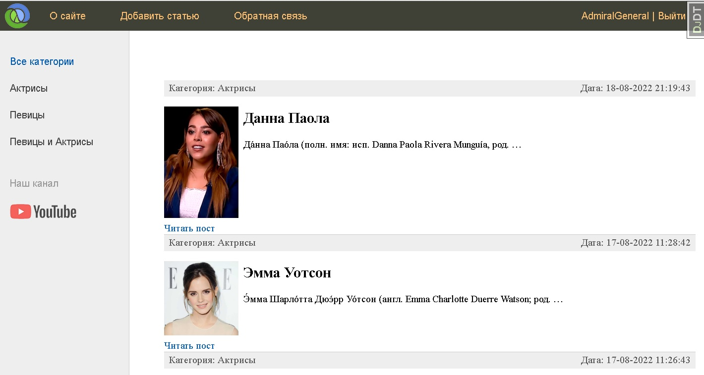

# Django Biography Blog

## Get start
*if you have make:*
```bash
make Makefile
make Makefile activate
make MAkefile migrate
```
*else*
```bash
virtualenv venv
echo 'Bash'
echo 'venv/bin/activate'
echo 'Windows'
venv\Script\activate

pip install requirements
cd bioblog
python manage.py migrate
python manage.py runserver
```

## Description
*Biography Blog with authentication and contact form. Modificated admin panel.*

## Topics
	- Biography
	- Admin-panel
	- Class-Based-Views

## Main page


## Example
```python
class WomenCategory(DataMixin, ListView):
	model = Women
	template_name = 'women/index.html'
	context_object_name = 'posts'
	# При отсутсвие каких - либо записей -> 404
	allow_empty = False

	def get_queryset(self):
		return Women.objects.filter(
				cat__slug=self.kwargs['cat_slug'],
				is_published = True).select_related('cat')

	def get_context_data(self, *, object_list=None, **kwargs):
		context = super().get_context_data(**kwargs)
		# context['title'] = 'Категория - ' + str(context['posts'][0].cat)
		# context['menu'] = menu
		# context['cat_selected'] = context['posts'][0].cat_id
		c = Category.objects.get(slug = self.kwargs['cat_slug'])
		c_def = self.get_user_context(
			title='Категория - ' + str(c.name), 
			cat_selected=c.pk
		)
		return dict(list(context.items()) + list(c_def.items()))
```
